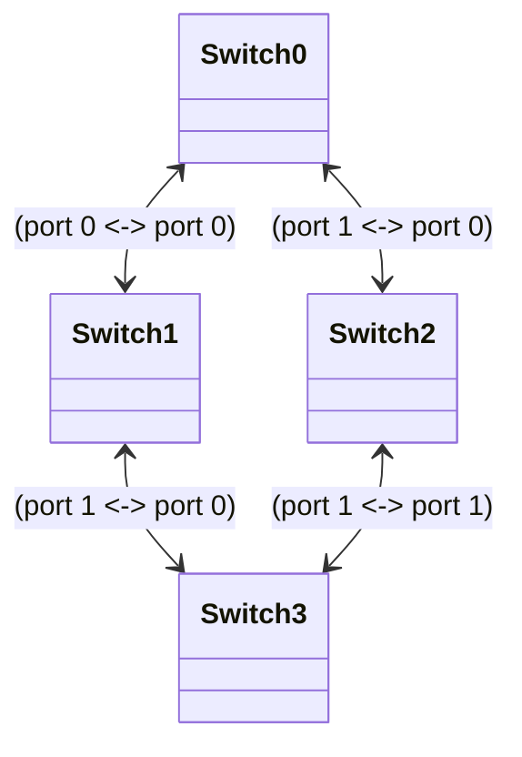

`./dpt myprog.dpt --spec myspec.json` runs the Lucid program `myprog.dpt` in the environment defined by the specification file `myspec.json`. 

## Specification file

The specification file configures the simulated network's topology and provides a list of input events to switches in the network. When the interpreter is called with program `prog.dpt`, it checks for an interpreter specification file named `prog.json` in the same directory as `prog.dpt`. Alternately, the specification file can be provided with the `--spec` flag, i.e., `./dpt prog.dpt --spec myspec.json`

A basic interpreter specification file is a json dictionary with two fields: "max time" and "events". For example, here is a specification file that can be used with [event_copies.dpt](https://github.com/PrincetonUniversity/dpt/blob/master/examples/interp/interp_tests/event_copies.dpt)

```
{
	"max_time":10000,

	"events": [
		{"name":"copies", "args":[1]},
		{"name":"copies", "args":[2]}
	]
}
```

This spec file instructs the interpreter to run for a maximum of 10000 time units and begin by processing two instances of a copy event, one with an argument of `1` and another with an argument of `2`.

Below, this document summarizes the entries in a specification file that configure the simulated networks topology and input events.

### Network topology

The interpreter's network consists of a set of switches, each running an instance of the same Lucid program, connected with bidirectional links. If no network configuration is given in the specification json, the network has 1 switch. The following entries in a specification file configure larger topologies.

#### "switches"

`"switches":n`, where `n` is an integer, sets the simulated network to have n switches, numbered from 0 - n-1.

#### "recirculation_ports"

This entry sets the recirculation port id for each switch in the network. It take a list of integers with length equal to the number of switches in the network. Each entry in the list defines the recirculation port for a single switch. 

#### "links"

The links field defines bidirectional links between pairs of switches in the network. Each endpoint of a link is defined by a pair of identifiers, the switch's id and the port id, written in the format  `"switch_num:port_num"`. For example, consider the following spec file snippet: 

```json
  "switches": 4,
  "links": {
    "0:0": "1:0",
    "0:1": "2:0",
    "1:1": "3:0",
    "2:1": "3:1"
  }
```

This configures the network topology illustrated below: a network with 4 switches (with ids 0 through 3) where switch 0 has links to switches 1 and 2, Switch 1 has  links to 0 and 3, and switch 2 has links to switches 0 and 3. 



 ### Network time

The interpreter network's time unit is the nanosecond. It models each pipeline in a switch processing 1 event per nanosecond. The simulation always begins at time 0. The following configuration json fields configure time-related options in the interpreter network.

#### "max time" 

`"max time":n` sets the end time of the simulation to the integer n.

#### "default input gap"

`"default input gap": n` sets the amount of time between consecutive input events to n nanoseconds. The default value is 0. 

### "generate delay" 

Interpreter switches add a fixed delay between event generation and event arrival at the destination switch, modeling transmission delay. 

`"generate delay": n` sets the delay to n nanoseconds. The default is 600, which is approximately the delay for a packet recirculation on a Tofino with empty queues. 

#### "random delay range"

`"random delay":n` adds between 1 to n-1 nanoseconds of random delay to each generated event. The default is 1, i.e., no delay. 

### Events

The "events" entry in the interpreter specification file contains a list of json dictionaries that each represent a single event to execute at one or more switches in the simulated network. 

Here is an example of a minimal event json, which contains the name of the event and its arguments: `{"name":"copies", "args":[1]}`

The specification of an event in json is an object with the following fields:

#### "name"

A string containing the name of the event to generate. Required field.

#### "args"

A list of json integers or booleans used as the event's arguments. Required field.

#### "timestamp"

An integer representing the time when this event should appear. Note that these events are not "generated", and thus are not subject to generation delay or random delays. If this field is omitted, it defaults to the timestamp of the previous entry in the event list plus the value of "default input gap" (or to 0, for the first entry in the list).

#### "locations"

A list of integers representing the switches this event should appear at. The default value is [0] (i.e. it appears only at switch 0).

### Unparsed packet events

The lucid interpreter can also be given a "packet" event which contains only an unparsed bytestring. Packet events are how you invoke the parser of a lucid program in the interpreter.

The json record for a packet event has the following form: 

`{"type":"packet", "bytes": HEX_STRING}`

where hex string is simply string of hexadecimals where each two digits represent a byte. For example, the hex string in this packet event: 

`{"type":"packet", "bytes":"0000000000030000000000040800"}` 

represents a 14 byte string (an ethernet header with dst_mac = 3, src_mac = 4, and ether_type = 0x0800).

[TODO: link to example]

### Control command events

Control commands are special events that one can send to the Lucid interpreter to read and write globals while the network is running. They represent actions that a switch's control CPU can perform on a switch's data plane state while it is running. Control commands allow users to write a model of the control program that will run along with a Lucid data plane on a physical switch. See  [control_commands.dpt](https://github.com/PrincetonUniversity/dpt/blob/master/examples/interp/interp_tests/control_commands.dpt) and  [control_commands.json](https://github.com/PrincetonUniversity/dpt/blob/master/examples/interp/interp_tests/control_commands.json)  for an example.

The json representation of a control command is similar to that of a user-defined Lucid event. However, the primary difference is that a _control command_'s entry must contain a field named "type" that has a value of "command". For example:

`{"type": "command", "name":"Array.get", "args":{"array":"myarr", "index":0}}`

This is the json representation of an `Array.get` command that fetches the value stored at index `0` of `myarr`, i.e., it is the equivalent of `Array.get(myarr, 0);` in a Lucid program.

There are currently 4 control commands: `Array.get` ,  `Array.getrange`, `Array.set`, `Array.setrange`, and `Table.install`.

#### "Array.get"

####  `{"type": "command", "name":"Array.get", "args":{"array":"A", "index":n}}`

gets the value stored at `A[n]` and prints it in a json record to stdout of the form: 

`{ "array": "A", "index": n, "value": [ v ] }`

Where `n` and `v` are integers.

#### "Array.getrange"

`{"type": "command", "name":"Array.getrange", "args":{"array":"A", "start":n, "end":m} }`

gets the values stored at `A[n]` to `A[m-1]` and prints it in a json record to stdout of the form: 

```
{
  "array": "A",
  "start": n,
  "end": m,
  "values": [ [ Av_n ], [ v_n+1 ], ..., [ v_m-1 ] ]
}
```

#### "Array.set"

`{"type": "command", "name":"Array.set", "args":{"array":"A", "index":n, "value":[v]}}`

sets `A[n]` to `v`. Note that the value field takes a _list_ containing a single integer.

#### "Array.setrange"

` {"type": "command", "name":"Array.setrange", "args":{"array":"A", "start":n, "end":m,"value":[v]}}`

sets all elements from `A[n]` to `A[m-1]` to value `v`.  

#### "Table.install"

Given a table defined as: 

```
table_type tbl_t = {
key_type = (key_ty1, ..., key_tyn);
arg_type = (arg_ty1, ..., arg_tym);
ret_ty : ret_ty;
}
global tbl tbl_t = table_create<tbl_t>((acnconstr_1, ..., acnconstr_k), n_entries, acnconstr_i(arg1, ...));
```

The table install command is of the form:

`{"type": "command", "name":"Table.install", "args":{"table":"tbl", "key":[pat1, ..., patn], "action":"tbl.acnconstr_j", "args":[arg1, ..., argl]}}`

This command installs an entry into `tbl` where the key is defined by `[pat1, ..., patn]` and the action is that generated by calling `acnconstr_j(arg1, ..., argl)`, where `acnconstr_j` is some action constructor bound to `tbl` in the first argument of `table_create`.

**json pattern values** patterns (used in the `key` field of a `Table.install` command's arguments) are represented as strings that have one of the three forms shown here: `"key":["5<<32>>", "_<<16>>", "9<<24>> &&& 7"]`.

The three forms are:

- **exact pattern** : A string of the form `v<<b>>`, which represents a `b` -bit integer of value `v` . 
- **wildcard pattern**: A string of the form `_<<b>>`, which represents a b-bit integer that matches any value.
- **masked pattern**:  A string of the form `v<<b>> &&& m`, which represents a b-bit integer that matches any value `v'` where `v' && m == v && m`. 

### Other configuration

#### "externs"

The "externs" entry carries a json object with one field for each `extern` value in the network. The value for that field should be a list of json integers or booleans, with one entry for each switch in the network. The first entry will be the value for switch 0, the second for switch 1, etc.

For example, 

```json
"externs" : {
	"my_extern1" : [10, 11, 12],
	"my_extern2" : [20, 22, 24]
}
```

Will initialize the value of `my_extern1` to 10 on switch 0, 11 on switch 1, and 12 on switch 2, and the value of `my_extern2` to 20 on switch 0, 22 on switch 1, and 24 on switch 2.

#### "random seed"

A seed for the random number generator. If none is provided, the simulator will generate one based on the current time.

#### "python path"

The path to the Python installation to use for extern functions. This is sometimes necessary when there are multiple versions of python installed on a system. You only need this if: 1) you are using extern functions; 2) you get a Python-related error message when one of the extern functions is called by the Lucid interpreter. 

The argument to "python path" should point to your installation's `libpython3.*.dylib` file, e.g. `"/Users/[you]/opt/anaconda3/lib/libpython3.9.dylib"`. Lucid will attempt to locate this file automatically, so this field is only required if it fails to do so.

## Interactive mode

Running the interpreter with the `-i` or `--interactive` flag puts it into _interactive_ mode. In this mode, after the interpreter executes all the events listed in the specification file, it enters a read-evaluate-print loop that reads event jsons from standard in and prints events leaving the network to standard out. 

### Input

Each line of input to the interactive interpreter's stdin must either be: 

1. a json event record, packet record, or control command record,  as defined in the event spec section (e.g, `{"name":"copies", "args":[1]}`)
2. a list of json event records (e.g., `[{"name":"copies", "args":[1]}, {"name":"copies", "args":[2]}]`). Note that the list must itself be a valid json object -- it needs the `[` and `]` at the start and end!

### Output

Interactive mode prints events exiting the network to stdout, formatted as a json. An event "leaves the network" if it is generated to a port on a switch that is not connected to another switch in the specification file. 

For example, if we have this topology defined in the specification file: 

```json
  "switches": 4,
  "links": {
    "0:0": "1:0",
    "0:1": "2:0",
    "1:1": "3:0",
    "2:1": "3:1"
  }
```

and on switch `0`, an event handler executes, `generate_port(5, foo(a, b ,c));`, the interpreter will print the event foo to stdout, annotated with the location that it was generated to (`"0:5"`). 

On the other hand, if switch 0 executes `generate_port(1, foo(a, b ,c));`, the interpreter will _not_ print anything to stdout, but rather just deliver the event to switch 2 port 0 (the other end of the link from `0:1` defined in the `links` entry of the specification file).

