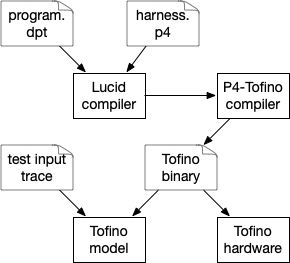

# Tutorial 3: compiling Lucid to P4-Tofino

This tutorial will walk through the pipeline of compiling a Lucid program to a P4 program and running it on the Tofino's ASIC model. To follow along, you should first make sure that P4-studio 9.5.0 is installed and your ``$SDE`` and ``$SDE_INSTALL`` variables are set. 

**Setting the p4-studio environment variables** *(a note for those unfamiliar with p4-studio)*: If you are working in a VM set up from [the guide](setup.md), the ``$SDE`` variable should be set at startup. If you are in a custom environment with p4-studio installed, copy ``<git root>/vm/set_sde.bash`` to the directory that contains p4-studio directory (e.g., ``~/bf-sde-9.5.0``). Then just run ``. ./set_sde.bash``. 


Here's how the Lucid-to-Tofino pipeline looks at a high level: 



You, as the programmer, write a Lucid program and a P4 harness / driver program that generates entry events for the program and handles any exit events that the program generates. The Lucid compiler translates the Lucid program and P4 harness into a single P4 program, which you then compile to a Tofino binary using the Tofino's native P4 compiler. Finally, you run this binary on either the Tofino's ASIC model or real hardware. 

This repository includes a lot of scripts to make this process easier. In fact, for the ``histogram.dpt`` example, you should just be able to use the makefile in ``examples/tutorial``: 

- ``make interp`` -- run the interpreter
- ``make compile`` -- compile histogram.dpt to P4, using ip_harness.p4 as a template
- ``make assemble`` -- compile the build directory produced by ``make compile`` into a tofino binary. 
- ``make test`` -- run the assembled tofino binary in the Tofino model, replaying the packets defined in ``histogram_test.json`` into it, and checking the output of the model for the packets also specified in ``histogram_test.json``

So, to go from the raw lucid source to a test on the Tofino ASIC model, do: 

```
vagrant@lucidvm:/lucid/examples/tutorial$ make compile
../../dptc histogram.dpt ip_harness.p4 hist_build
clearing build directory: hist_build

Processing histogram.dpt
#
# Lucid compiler output elided
#
Packager: Packaging lucid tofino app in: hist_build
Packager: copying runtime libraries from: /lucid/tofinoLibs
Packager: Writing P4 to: lucid.p4
Packager: Writing C to: lucid.cpp
Packager: Writing python to: lucid.py
Packager: generating makefile: hist_build/makefile 
Packager: Lucid app generation complete in: hist_build

vagrant@lucidvm:/lucid/examples/tutorial$ make assemble
cd hist_build; make build    
make[1]: Entering directory '/lucid/examples/tutorial/hist_build'
**** compiling lucid.p4 to lucid ****
#
# P4-Tofino compiler output elided
# 
**** done compiling lucid.p4 to lucid ****
# ...
make[1]: Leaving directory '/lucid/examples/tutorial/hist_build'

vagrant@lucidvm:/lucid/examples/tutorial$ make test
vagrant@lucidvm:/lucid/examples/tutorial$ make test
cd hist_build; make test ../histogram_test.json
make[1]: Entering directory '/lucid/examples/tutorial/hist_build'
**** generating test pcap with 5 pkts from test spec ****
**** starting tofino model and p4 program ****
# 
# model output elided
#
**** cleaning up ****
**** stopping simulator and switchd ****
**** checking test spec against model log ****
PASS
make[1]: Leaving directory '/lucid/examples/tutorial/hist_build'
```

The rest of this tutorial walks through the contents of a P4 harness and the input / output of each script used by the makefile above. 

## P4 harness files

A Lucid program interfaces with the network through a p4 *harness*. The main tasks of the harness are converting packets into entry events, calling the Lucid handler for every packet with an event, and finally handling any exit events generated by the Lucid program. A harness can be used for any Lucid program with the same entry and exit event definitions. For example, ``histogram.dpt`` uses ``ip_harness.p4`` -- this harness will work for any Lucid program that defines the same entry and exit events as ``histogram.dpt``: 
```
entry event ip_in (int<<9>> igr_port, int src, int dst, int<<16>> len, int<<8>> tos);
exit event ip_out (int<<9>> egr_port, int src, int dst);
```

For each of these events, the Lucid compiler generates a metadata structure that gets inlined into the harness. The harness then uses the event metadata structures in its ingress block. For example, when the compiler builds ``histogram.dpt``, it generates the following entry and exit event structures, based on the event declarations above: 

```
struct ip_in_t {
    bit<9> igr_port;
    bit<32> src;
    bit<32> dst;
    bit<16> len;
    bit<8> tos;
}
struct ip_out_t {
    bit<9> egr_port;
    bit<32> src;
    bit<32> dst;
}
```

The Lucid compiler inlines these definitions into ``ip_harness.p4``. The ingress block of the harness file then uses instances of the ``ip_in_t`` and ``ip_out_t`` structs in its ingress pipeline. The Lucid compiler automatically inlines these instances in the global ``md`` struct. 
```
control Ingress(
        inout header_t hdr, 
        inout metadata_t md,
        in ingress_intrinsic_metadata_t ig_intr_md,
        in ingress_intrinsic_metadata_from_parser_t ig_prsr_md,
        inout ingress_intrinsic_metadata_for_deparser_t ig_dprsr_md,
        inout ingress_intrinsic_metadata_for_tm_t ig_tm_md) {

    @DPT_OBJECTS

    CiL2Fwd() ciL2Fwd; 

    action setup_lucid_entry_event() {
        md.dptMeta.eventType = e_ip_in;
        md.ip_in.tos = hdr.ip.tos;
        md.ip_in.src = hdr.ip.src_addr;
        md.ip_in.dst = hdr.ip.dst_addr;
        md.ip_in.len = hdr.ip.total_len;
    }
    action use_lucid_exit_event(){
        ig_tm_md.ucast_egress_port = md.ip_out.egr_port;
        hdr.ip.src_addr = md.ip_out.src;
        hdr.ip.dst_addr = md.ip_out.dst;        
    }

    apply {
        if (hdr.ethernet.ether_type == ETHERTYPE_IPV4) {
            setup_lucid_entry_event();
        }
        // If the packet is not an event, apply user P4.
        if (md.dptMeta.eventType == 0) {
            ciL2Fwd.apply(ig_intr_md, ig_tm_md);                       
        } else {
            // Otherwise, apply Lucid-generated P4.
            @DPT_HANDLERS            
            // Finally, handle any Lucid exit events.
            if(md.dptMeta.exitEventType == e_ip_out) {
                use_lucid_exit_event();
            }
        }
    }
}
```

As we see, the control flow of the harness is simple. First, if a packet is an IP packet, the harness calls a user-written action ``setup_lucid_entry_event()`` which prepares an ``ip_in`` event by filling in the ``md.ip_in`` structure and setting the Lucid-generated variable ``md.dptMeta.eventType`` to the Lucid-generated constant ``e_ip_in``. 

Next, if ``md.dptMeta.eventType`` is set, the harness passes control to Lucid with the ``@DPT_HANDLERS`` pragma. The Lucid compiler replaces ``@DPT_HANDLERS`` with a sequence of calls to compiler-generated tables, which execute the Lucid handlers. After the Lucid handlers return, the harness check to see whether Lucid returned the exit event ``ip_out`` and, if so, the harness calls ``use_lucid_output()`` to set packet header fields from ``ip_out``. 

## Compiling to P4

To compile a Lucid program to P4, use ``dptc <lucid program> <p4 harness> <build directory>``. For the ``histogram.dpt`` example, compile with: 

``vagrant@lucidvm:/lucid/examples/tutorial$ ../../dptc histogram.dpt ip_harness.p4 build``

The Lucid compiler will flood your screen with debug messages and eventually create the directory ``build``, with the following structure: 

- ``build/lucid.p4`` -- the P4 program implementing the Lucid program and the P4 harness.
- ``build/lucid.cpp`` -- a low-level control program to set up event delay queues. This is just a stub for now. 
- ``build/lucid.py`` -- a python setup script that install multicast rules for event generation. 
- ``build/makefile`` -- a simple makefile to compile the P4 to the Tofino and test the ASIC simulator. 
- ``build/libs/*`` -- generic helper scripts for compiling and running P4 programs, generating PCAPs from test specification files, and parsing output from the Tofino ASIC model.
- ``build/src/*`` -- the orginal lucid program and p4 harness. 

## Compiling to the Tofino

To compile the Lucid build directory to the Tofino, make sure your ``$SDE`` environment variable is set for the P4 studio SDE, then run ``make build`` from inside of the build directory. The makefile calls ``./libs/p4tapp.sh build lucid.p4``. This will print the Tofino compiler's output on the screen and eventually produce a directory ``build/lucid``, which has all the files generated by the P4 compiler (``manifest.json``, ``pipe/*``, etc.) To check if the P4 compilation succeeded, look at ``build/lucid/manifest.json``. 

## Testing on the Tofino model 

At this point the ``/build/lucid`` directory has everything you need to run on a real Tofino or the Tofino model. Lucid includes scripts that automate testing with the Tofino model. The input to the scripts is a test case specification json. Here's the one we will use with the ``histogram.dpt`` example, ``histogram_test.json``: 

```
{
    "name" : "histogram_test", 
    "input_port": "128",
    "packets": [
        {"ip.src" : "1.1.1.1", "ip.dst" : "2.2.2.2", "payload.length" : 256},
        {"ip.src" : "2.1.1.1", "ip.dst" : "2.2.2.2", "payload.length" : 256},
        {"ip.src" : "3.1.1.1", "ip.dst" : "2.2.2.2", "payload.length" : 256},
        {"ip.src" : "4.1.1.1", "ip.dst" : "2.2.2.2", "payload.length" : 768},
        {"ip.src" : "5.1.1.1", "ip.dst" : "2.2.2.2", "payload.length" : 768}
    ],
    "model-output":
    [
        {"port" : 128, "ip.src" : "1.1.1.1", "ip.dst" : "2.2.2.2"},
        {"port" : 128, "ip.src" : "2.1.1.1", "ip.dst" : "2.2.2.2"},
        {"port" : 128, "ip.src" : "3.1.1.1", "ip.dst" : "2.2.2.2"},
        {"port" : 128, "ip.src" : "4.1.1.1", "ip.dst" : "2.2.2.2"},
        {"port" : 128, "ip.src" : "5.1.1.1", "ip.dst" : "2.2.2.2"},
        {"port":132, "ip.src" : "0.0.0.0", "ip.dst" : "0.0.0.0"},
        {"port":132, "ip.src" : "0.0.0.1", "ip.dst" : "0.0.0.3"},
        {"port":132, "ip.src" : "0.0.0.2", "ip.dst" : "0.0.0.1"},
        {"port":132, "ip.src" : "0.0.0.3", "ip.dst" : "0.0.0.0"}
    ]
}
```

``input_port`` specifies the dpid of the port to send packets into to test the Tofino. ``packets`` is a list of packets that will be converted into a PCAP and sent into a veth interface connected to ``input_port``. ``model_output`` is a list of packets that we expect to find in the output of the Tofino ASIC model. 

To test the histogram example with this spec, run: 

``vagrant@lucidvm:/lucid/examples/tutorial/hist_build$ make test ../histogram_test.json``

The makefile will call ``hist_build/libs/p4tapp.sh``, which will start an instance of the Tofino ASIC model, start the Tofino bf_switchd manager agent, load the Tofino project in ``hist_build/lucid`` into bf_switchd, and start the python controller for the lucid program (``hist_build/lucid.py``). All the output from these processes will be spooled to stdout and also saved in ``hist_build/runlogs``. 

After everything is running, ``p4tapp.sh`` will use ``hist_build/libs/testspec_utils.py`` to generate a packet trace from ``histogram_test.json`` and send it into the Tofino model using tcpreplay. The model's output will flash across the screen as it runs. When the test is finished, ``p4tapp.json`` will use ``hist_build/libs/check_testspec.py`` to to parse the output of the Tofino model (saved in ``hist_build/run_logs/model.*.log``) and check for the packets specified in the ``model_output`` list of ``histogram_test.json``. 

If everything goes right, the last lines of the output from ``make test ../histogram_test.json`` will be:
```
**** cleaning up ****
**** stopping simulator and switchd ****
**** checking test spec against model log ****
PASS
```


## Next steps

There are many more features of Lucid that will be introduced in future tutorials. For now, check out the programs in ``examples/execution_testing`` for more examples that have been tested to run on the Tofino model. Other programs in ``examples`` may have only been tested with the interpreter for now. For more details on the language, see the wiki.