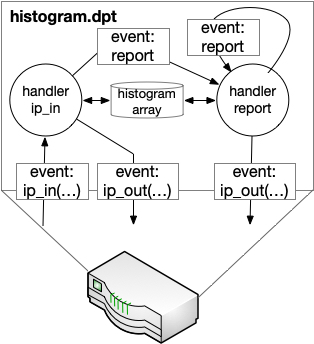

# Tutorial 1: Introduction to Lucid
There are three core abstractions in Lucid: events, handlers, and arrays. To see how we use these primitives, lets look at ``examples/histogram.dpt`` -- a simple measurement application that reports a histogram of recent packet sizes to a collection server at regular intervals. 

Here's a visual representation of ``histogram.dpt``:



### Events and Handlers

When ip packets arrive, the switch generates an ``ip_in`` *event*. This event is declared in the Lucid program and carries the packet's addresses, input port, ip length, and ip tos. The ``ip_in`` *handler* processes the event. The handler:

1. Increments a histogram array that persists across packets.
2. Increments a total packet count array.
3. Sends the packet back out of its input port.
4. If the total packet count is above a threshold, generates a ``report`` event to export the histogram to the collection server and reset it. 

Here's the handler code: 

```
handle ip_in (int<<9>> igr_port, int src, int dst, int<<16>> len, int<<8>> tos) {
  int idx = 0;
  if (len <= 128) { 
    idx = 0;
  } else {
    if (len <= 512) {
      idx = 1;
    } else {
      if (len <= 1024){ 
        idx = 2;
      } else {
        idx = 3;
      }
    }
  }
  Array.setm(hist_arr, idx, incr, 1);
  int total_ct = Array.update(total_arr, 0, incr, 1, incr, 1);
  if (total_ct == pktct_interval) {
    generate report(0);
  }
  generate ip_out(igr_port, src, dst);
}
```

As we can see in this ``ip_in`` handler, handlers are simple imperative functions that can generate other events. When a handler generates an event, the event is encoded into a packet, recirculated, and processed in a subsequent pass through the switch's pipeline. You can think of a handler ``foo`` that generates an event ``bar`` as a function ``foo`` that invokes a continuation or callback function ``bar`` asynchronously, at some time in the future. Handlers that generate events are powerful because they express recursive computation in a way that maps naturally to the underlying hardware. In the histogram example, the ``report`` event is recursive: 
```
handle report(int idx){
    int cur_idx = idx; 
    int column_ct = Array.update(hist_arr, cur_idx, getf, 0, setf, 0);
    generate ip_out(collector_port, cur_idx, column_ct);                
    if (cur_idx == 0) {
      Array.set(total_arr, 0, 0);      
    }
    if (cur_idx < 3){       
      generate report(cur_idx + 1);
    }
}
```

This handler processes ``hist_arr[idx]``, then generate another ``report`` event to process ``hist_arr[idx+1]``. Each event gets executed in a separate pass through the switch's pipeline and the recursion continues until all 4 elements of ``hist_arr`` are processed. Each recursive call has a cost -- a packet is recirculated. But there is no way around that, since the underlying hardware can only access one element of each persistent memory array per packet. 

#### Entry and exit events

In ``histogram.dpt``, we see that some event declarations are prefixed with the ``entry`` or ``exit`` keyword. 
```
entry event ip_in (int<<9>> igr_port, int src, int dst, int<<16>> len, int<<8>> tos);
event report(int idx);
exit event ip_out (int<<9>> egr_port, int src, int dst);
```

A regular event, without either keyword, is an event that is generated by a Lucid handler and processed by a Lucid handler. Entry and exits events are how a switch transfers control flow to / from a Lucid program. An *entry* event is an event that is generated by *the switch's underlying P4 program* and processed by a Lucid handler. Finally, an *exit* event is the opposite of an entry event -- it is generated by a Lucid handler and *processed by the underlying P4 program*. We will talk about this more in a later tutorial that goes over compiling Lucid programs to P4. 


### Arrays 

Lucid programs interact with persistent state with the *Array* module, which is used in the above snippet. When you call a method of the Array module, you typically pass it a memop function -- a simple function that describes the computation to perform on state read from persistent memory before returning the result to either the memory cell it was read from, or a local variable in the handler. For example, in ``ip_in``, we see this line: ``Array.setm(hist_arr, idx, incr, 1);``, which we would write in C as: ``hist_arr[idx] = incr(hist_arr[idx], 1);`` The point of writing this line as a call to Array.setm, instead of some general syntax like C, is to ensure that the program only does a small amount of computation between the read and the write to ``hist_arr[idx]``, so that Lucid can guarantee that is will compile to the underlying hardware. 

Lucid ensures that Array operations are simple enough for the hardware by placing syntactic restrictions on the functions that can be passed to array methods -- ``incr``, for example. These restricted functions are "memops" -- operations that are simple enough to perform on persistent memory at line rate. Memops are just functions that must adhere to three simple rules:

1. a memop can only have two arguments.
2. a memop can only consist of a return statement, or a single if / else statement with a return statement in each branch.
3. a memop can only use each of its arguments once in its body. 

If a function does not adhere to these rules, a Lucid program will not type check and the Lucid type checker will tell the programmer which rule failed for which memop. These restrictions are *more* limiting than the restrictions of the underlying hardware, but they present a simpler and regular interface to state that simplifies a developer's mental model. In the future, our goal is for Lucid's memop syntax to be extendible, so that developers can choose their own balance between regularity and completeness. 

In ``ip_in`` from ``histogram.dpt``, the ``incr`` memop is also passed to ``Array.update``, which performs memory read and write operations in parallel. In the example, we have ``int total_ct = Array.update(total_arr, 0, incr, 1, incr, 1);``. In C, we would write this as: ``int tmp = incr(total_arr[0], 1); total_arr[0] = incr(total_arr[0], 1); total_ct = tmp;``. 

Again, Lucid can guarantee that any ``Array.update`` call can be compiled to the underlying hardware, because of the restrictions on memops. 

A second restriction on arrays is that, in every handler, all arrays must be accessed in the order that they are declared. This is also enforced by the type checker, to catch programs that have no chance of compiling to the underlying hardware and give programmers useful error messages when they write such programs. 


### Next steps

Continue to the next tutorial, on how to run a Lucid program in the interpreter [tutorial_interpreter](tutorial_interpreter.md).