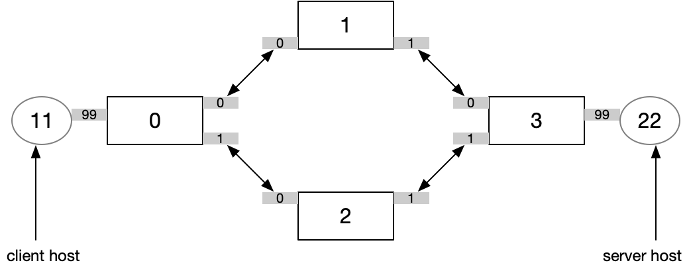

### static routing example

This example implements a network with 4 switches that use static routing to forward packets between 2 endhosts. The example is designed mainly run in the Lucid interpreter, with the network's topology provided by the interpreter specification file. 

To run the program from the root of the Lucid repo, do: 

```
./lucid.sh interp examples/static_routing/staticrouter.dpt
```
(this assumes you have already installed docker and run `./lucid.sh pull`)

#### Network topology

Here's the physical topology of the network we will use in this example: 

- There are 4 switches in this network, represented by the large white rectangles. The switches have globally unique identifiers (0, 1, 2, and 3). 

- Each switch has some number of physical ports, represented by the small grey boxes in the diagram. Port identifiers are locally unique, so for example every switch in the network has a port 0. The globally unique identifier of a port is the concatenation of its switch id and port id, which we write as <switch>:<port>. 

- Switches are connected to each other via bidirectional links across ports. For example, switch 0 and 2 are connected with the link (0:1, 2:0). When switch 0 sends a packet (or event) out of port 1, it will arrive at port 0 on switch 2. 
  
- Finally, there are also 2 endhosts in this network, represented by circles in the diagram. Each endhost has an address and connect to a specific port of a specific switch. 

#### Configuring the topology
  
When we run the Lucid interpreter, we give it a configuration json file (``staticrouter.json``) that specifies the number of switches and the links between the switches. Here is the relevant part of this example's interpreter configuration file: 
``` 
  "switches": 4,
  "links": {
    "0:0": "1:0",
    "0:1": "2:0",
    "1:1": "3:0",
    "2:1": "3:1"
  }
```

Each entry in the "links" dictionary creates one link in the interpreter's model of the network. 
  
#### Forwarding packets as events

In this example, each switch in the example network will execute the same Lucid program, ``staticrouter.dpt``. This program represents packets as ``ip_pkt`` events. Each ``ip_pkt`` event carries two integer parameters, a source and a destination. The declaration for ``ip_pkt`` is simply:

``event ip_pkt (int src, int dst);``
  
Whenever an ``ip_pkt`` event arrives at a switch, it triggers the ``ip_pkt`` handler. The main thing this handler does is selects an output port and generates a copy of the ``ip_pkt`` event to that output port. 
   
```
fun int get_output_port(int current_switch, int dst) {
	match (current_switch, dst) with 
		| 0, 22 -> {return 0;}
		| 1, 22 -> {return 1;}
		| 2, 22 -> {return 1;}
		| 3, 22 -> {return 99;}
		| 0, 11 -> {return 99;}
		| 1, 11 -> {return 0;}
		| 2, 11 -> {return 0;}
		| 3, 11 -> {return 0;}
}
handle ip_pkt(int src, int dst) {
	// ingress_port 
	int out_port = get_output_port(self, dst);
	printf ("packet entered switch %d from port %d. Forwarding out of port: %d", self, ingress_port, out_port);
	generate_port(out_port, ip_pkt(src, dst));
...
}  
```

Notes: 
  - ``get_output_port`` just wraps a match statement that implements a static forwarding table to select the output port.
  - ``self`` is a Lucid builtin for "the unique identifier of this switch"
  - ``ingress_port`` is a Lucid builtin for "the port that this packet came in on"
  - The ``generate_port`` function is what "moves" a packet from one switch to another. The first argument of ``generate_port`` is the output port, the second argument is the event to generate. In a real network, events may have payloads that are invisible to the Lucid program. ``generate`` commands always copy the input event's payload to the output event.

  
#### Input events
  
The interpreter executes the program over the sequence of events defined in the "events" block of the interpreter specification json (`staticrouter.json`). Here is the event block for this example:
  
```  
  "events": [
    {
      "name": "ip_pkt", 
      "args": [11,22],
      "locations": ["0:99"],
      "timestamp":1200
    },
    {
      "name": "ip_pkt", 
      "args": [22,11],
      "locations": ["3:99"],
      "timestamp":2200
    }
  ]
```
  
Notes:
  - The event block is just a list of events. Each event has a name, a list of arguments, a list of ports on which the event arrives, and a timestamp at which the event should arrive at that port. 
  
#### Interpreter output
  
  
When we execute the interpreter (with `./lucid.sh interp examples/static_routing/staticrouter.dpt`), we will see a trace of events arriving at and being handled by each switch in the network, with the output of any printf calls executed, and a summary of the final array state in each switch after the simulation had ended: 
  
```
t=1200: Handling event ip_pkt(11,22) at switch 0, port 99
packet entered switch 0 from port 99. Forwarding out of port: 0
t=1800: Handling event count_src(11) at switch 0, port 196
counting packet with src=11 at switch 0
t=1800: Handling event ip_pkt(11,22) at switch 1, port 0
packet entered switch 1 from port 0. Forwarding out of port: 1
t=2200: Handling event ip_pkt(22,11) at switch 3, port 99
packet entered switch 3 from port 99. Forwarding out of port: 0
t=2400: Handling event count_src(11) at switch 1, port 196
counting packet with src=11 at switch 1
t=2400: Handling event ip_pkt(11,22) at switch 3, port 0
packet entered switch 3 from port 0. Forwarding out of port: 99
t=2800: Handling event ip_pkt(22,11) at switch 1, port 1
packet entered switch 1 from port 1. Forwarding out of port: 0
t=2800: Handling event count_src(22) at switch 3, port 196
counting packet with src=22 at switch 3
t=3000: Handling event count_src(11) at switch 3, port 196
counting packet with src=11 at switch 3
t=3400: Handling event ip_pkt(22,11) at switch 0, port 0
packet entered switch 0 from port 0. Forwarding out of port: 99
t=3400: Handling event count_src(22) at switch 1, port 196
counting packet with src=22 at switch 1
t=4000: Handling event count_src(22) at switch 0, port 196
counting packet with src=22 at switch 0
dpt: Final State:

Switch 0 : {

 Pipeline : [
    0 : [0u32; 0u32; 0u32; 0u32; 0u32; 0u32; 0u32; 1u32; 0u32; 0u32; 0u32; 0u32; 1u32; 0u32; 0u32; 0u32]
  ]

 Events :   [ ]

 Exits :    [
    ip_pkt(22,11) at port 99, t=3400
  ]

 entry events handled: 0
 total events handled: 4

}
...    
```
Note that the interpreter reports arrays by number rather than name. Arrays are numbered in the order that they are declared, starting at 0. 

  
   
#### Background events


The ``ip_pkt`` handler also generates a ``count_src`` event, with no specified port. The ``generate`` function produces a **recirculated** event, that is, an event that gets handled by the **current** switch at some point in the future. Recirculated events let us implement logic that requires multiple passes through the switch's pipeline. In this example, recirculation is not actually necessary because we could inline the update to the ``src_cts`` array into the ``ip_pkt`` handler. However, it is easy to imagine an example where it is needed: for example if we wanted to count the number of packets from both the source and destination addresses in the same array. 
