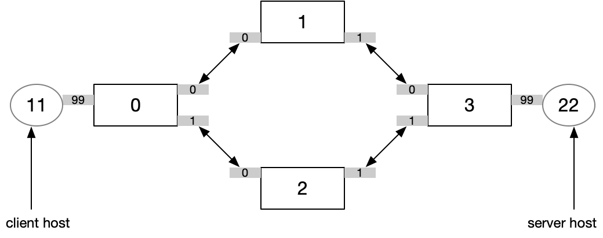

### static routing example

This example implements a network with 4 switches that use static routing to forward packets between 2 endhosts. The example is designed mainly run in the Lucid interpreter, with the network's topology provided by the interpreter specification file. 

#### Network topology

Here's the physical topology of the network we want to build: 
