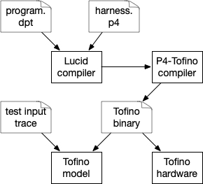

# Tutorial 3: compiling Lucid to P4-Tofino

This tutorial will walk through the pipeline of compiling a Lucid program to a P4 program and running it on the Tofino's ASIC model. To follow along, you should first make sure that P4-studio 9.5.0 is installed and your ``$SDE`` and ``$SDE_INSTALL`` variables are set. 

**Setting the p4-studio environment variables** *(a note for those unfamiliar with p4-studio)*: If you are working in a VM set up from [the guide](setup.md), the ``$SDE`` variable should be set at startup. If you are in a custom environment with p4-studio installed, copy ``<git root>/vm/set_sde.bash`` to the directory that contains p4-studio directory (e.g., ``~/bf-sde-9.5.0``). Then just run ``. ./set_sde.bash``. 


Here's how the Lucid-to-Tofino pipeline looks at a high level: 



You, as the programmer, write a Lucid program and a configuration file that binds the Lucid program to a lower level P4 harness. The harness generates converts incoming packets into entry events for the Lucid program, and converts generated events into updates for outgoing packets. The Lucid compiler combines the P4 that it generates with the P4 harness and produces a single P4 program, which you then compile to a Tofino binary using the Tofino's native P4 compiler. Finally, you run this binary on either the Tofino's ASIC model or real hardware. 

This repository includes a lot of scripts to make this process easier. In fact, for the ``histogram.dpt`` example, you should just be able to use the makefile in ``examples/tutorial``: 

- ``make interp`` -- run the interpreter
- ``make compile`` -- compile histogram.dpt to P4, using ip_harness.p4 as a template
- ``make assemble`` -- compile the build directory produced by ``make compile`` into a tofino binary. 
- ``make test`` -- run the assembled tofino binary in the Tofino model, replaying the packets defined in ``histogram_test.json`` into it, and checking the output of the model for the packets also specified in ``histogram_test.json``

So, to go from the raw lucid source to a test on the Tofino ASIC model, do: 

```
vagrant@lucidvm:/lucid/examples/tutorial$ make compile
../../dptc histogram.dpt ip_harness.p4 hist_build
clearing build directory: hist_build

Processing histogram.dpt
#
# Lucid compiler output elided
#
Packager: Packaging lucid tofino app in: hist_build
Packager: copying runtime libraries from: /lucid/tofinoLibs
Packager: Writing P4 to: lucid.p4
Packager: Writing C to: lucid.cpp
Packager: Writing python to: lucid.py
Packager: generating makefile: hist_build/makefile 
Packager: Lucid app generation complete in: hist_build

vagrant@lucidvm:/lucid/examples/tutorial$ make assemble
cd hist_build; make build    
make[1]: Entering directory '/lucid/examples/tutorial/hist_build'
**** compiling lucid.p4 to lucid ****
#
# P4-Tofino compiler output elided
# 
**** done compiling lucid.p4 to lucid ****
# ...
make[1]: Leaving directory '/lucid/examples/tutorial/hist_build'

vagrant@lucidvm:/lucid/examples/tutorial$ make test
vagrant@lucidvm:/lucid/examples/tutorial$ make test
cd hist_build; make test ../histogram_test.json
make[1]: Entering directory '/lucid/examples/tutorial/hist_build'
**** generating test pcap with 5 pkts from test spec ****
**** starting tofino model and p4 program ****
# 
# model output elided
#
**** cleaning up ****
**** stopping simulator and switchd ****
**** checking test spec against model log ****
PASS
make[1]: Leaving directory '/lucid/examples/tutorial/hist_build'
```

The rest of this tutorial walks through linking a Lucid program to a lower-level P4 program and the input / output of each script used by the makefile above. 

## Linking Lucid into P4
A Lucid program operates on abstract events, but a physical switch operates on packets. Recall that the entry point of the histogram example is the ``ip_in`` event, and the exit point is the ``ip_out`` event. 

```
entry event ip_in (int<<9>> igr_port, int src, int dst, int<<16>> len, int<<8>> tos);
exit event ip_out (int<<9>> egr_port, int src, int dst);
```

To actually run a Lucid program on a switch, we need to map incoming packets to entry events, and also map exit events to updates of outgoing packets. The easiest way to define these mappings is in a linker configuration file. The linker configuration file for the histogram example is ``linker_config.json``. 
```
{
    "entry" : 
    [
        {
            "event" : "ip_in",
            "conditions" : {"hdr.ip.isValid()" : [true], "ig_intr_md.ingress_port" : [128, 132]},
            "inputs" : {
                "igr_port":"ig_intr_md.ingress_port",
                "src":"hdr.ip.src_addr",
                "dst":"hdr.ip.dst_addr",
                "len":"hdr.ip.total_len", 
                "tos":"hdr.ip.tos"              
            }
        }
    ],
    "exit" : 
    [
        {
            "event" : "ip_out",
            "outputs" : {
                "ig_tm_md.ucast_egress_port" : "egr_port" ,
                "hdr.ip.src_addr" : "src",
                "hdr.ip.dst_addr" : "dst"
            }
        }
    ]
}
```

The linker configuration file has two blocks. The core task of these blocks is binding *header and metadata fields defined in an underlying P4 program* to *entry and exit event parameters defined in Lucid*.

The above configuration file says, in english: 

1. The P4 program should generate an ``ip_in`` entry event (defined in the Lucid program) whenever the P4 field ``hdr.ip.isValid()`` has a value of ``true`` and the P4 field ``igr_intr_md.ingress_port`` has a value of either ``128`` or ``132``. In other words, generate an ``ip_in`` event for every packet that has a valid IP header and arrives on port 128 or 132, as determined by the underlying P4 program.

2. Whenever the P4 program generates an ``ip_in`` entry event, set the event's arguments to the values of the following P4 fields: ``igr_port`` := ``ig_intr_md.ingress_port``; ``src`` := ``hdr.ip.src_addr``; ``dst`` := ``hdr.ip.dst_addr``; ``len`` := ``hdr.ip.total_len``; ``tos`` := ``hdr.ip.tos``.

3. Whenever the Lucid program generates an ``ip_out`` exit event, set P4 fields based on values of ``ip_out`` parameters: ``ig_tm_md.ucast_egress_port`` := ``egr_port``; ``hdr.ip.src_addr`` := ``src``; ``hdr.ip.dst_addr`` := ``dst``.  


### Entry configuration
The ``entry`` block specifies, for each entry event in a Lucid program: 1) when to generate the event (the ``conditions`` block) and 2) how to set the event's input arguments (the ``inputs`` block). 

**Conditions.** Each item in the conditions block maps a P4 header or metadata field to a list of values. *An entry event gets generated if and only if each field in its conditions block matches one of the listed values.* Please keep in mind, only one entry event can be generated for each packet. If the conditions for two entry events overlap, only the first-defined entry event will get generated. 

**Inputs.** Each item in the inputs block specifies how a parameter of the event will be set, when the event is generated.  

### Exit configuration
The ``exit`` block binds the parameters of exit events in a Lucid program to packet header or metadata fields. There is one configuration block for each exit event. In the configuration block of an exit event, each item in the ``outputs`` block maps a single exit event parameter to a P4 header or metadata field. When the Lucid program generates the exit event, the corresponding fields will be updated as specified. 


### P4 harnesses
We call the underlying P4 program that a Lucid program links into a P4 harness. The P4 harness is where the P4 fields used in the linker configuration file (e.g., ``linker_config.json``) are defined and parsed. A linker configuration file is allowed to reference any P4 field that is a parameter of the ``Ingress`` block of the  harness. So for, example, in ``linker_config.json`` we reference the P4 field ``hdr.ip.src_addr``. ``hdr`` is a parameter of the ``Ingress`` block, of type ``header_t``; ``header_t`` is a P4 structure that contains a header ``ip`` of type ``ipv4_h``; finally, ``ipv4_h`` has the field ``src_addr``. 

*Note for P4 novices: the ``isValid()`` field is a special P4 built-in that indicates whether the given header has been parsed. So ``hdr.ip.isValid()`` is set to ``true`` iff ``hdr.ip`` has been parsed successfully.* 


If you look into the harness, you will see that it is basically just a P4 program annotated with a few Lucid-specific pragmas that the Lucid compiler replaces with generated code. The only time you need to change a P4 harness should be when you want to change the parser or add other custom P4 code that executes before, after, or instead of Lucid event handlers. 

## The Lucid to Tofino Toolchain

### Compiling to P4
To compile a Lucid program to P4, use ``dptc <lucid program> <p4 harness> <linker config json> <build directory>``. For the ``histogram.dpt`` example, compile with: 

``vagrant@lucidvm:/lucid/examples/tutorial$ ../../dptc histogram.dpt ip_harness.p4 linker_config.json build``

The Lucid compiler will flood your screen with debug messages and eventually create the directory ``build``, with the following structure: 

- ``build/lucid.p4`` -- the P4 program implementing the Lucid program and the P4 harness.
- ``build/lucid.cpp`` -- a low-level control program to set up event delay queues. This is just a stub for now. 
- ``build/lucid.py`` -- a python setup script that install multicast rules for event generation. 
- ``build/makefile`` -- a simple makefile to compile the P4 to the Tofino and test the ASIC simulator. 
- ``build/libs/*`` -- generic helper scripts for compiling and running P4 programs, generating PCAPs from test specification files, and parsing output from the Tofino ASIC model.
- ``build/src/*`` -- the orginal lucid program and p4 harness. 

### Compiling to the Tofino
To compile the Lucid build directory to the Tofino, make sure your ``$SDE`` environment variable is set for the P4 studio SDE, then run ``make build`` from inside of the build directory. The makefile calls ``./libs/p4tapp.sh build lucid.p4``. This will print the Tofino compiler's output on the screen and eventually produce a directory ``build/lucid``, which has all the files generated by the P4 compiler (``manifest.json``, ``pipe/*``, etc.) To check if the P4 compilation succeeded, look at ``build/lucid/manifest.json``. 

### Testing on the Tofino model 
At this point the ``/build/lucid`` directory has everything you need to run on a real Tofino or the Tofino model. Lucid includes scripts that automate testing with the Tofino model. The input to the scripts is a test case specification json. Here's the one we will use with the ``histogram.dpt`` example, ``histogram_test.json``: 

```
{
    "name" : "histogram_test", 
    "input_port": "128",
    "packets": [
        {"ip.src" : "1.1.1.1", "ip.dst" : "2.2.2.2", "payload.length" : 256},
        {"ip.src" : "2.1.1.1", "ip.dst" : "2.2.2.2", "payload.length" : 256},
        {"ip.src" : "3.1.1.1", "ip.dst" : "2.2.2.2", "payload.length" : 256},
        {"ip.src" : "4.1.1.1", "ip.dst" : "2.2.2.2", "payload.length" : 768},
        {"ip.src" : "5.1.1.1", "ip.dst" : "2.2.2.2", "payload.length" : 768}
    ],
    "model-output":
    [
        {"port" : 128, "ip.src" : "1.1.1.1", "ip.dst" : "2.2.2.2"},
        {"port" : 128, "ip.src" : "2.1.1.1", "ip.dst" : "2.2.2.2"},
        {"port" : 128, "ip.src" : "3.1.1.1", "ip.dst" : "2.2.2.2"},
        {"port" : 128, "ip.src" : "4.1.1.1", "ip.dst" : "2.2.2.2"},
        {"port" : 128, "ip.src" : "5.1.1.1", "ip.dst" : "2.2.2.2"},
        {"port":132, "ip.src" : "0.0.0.0", "ip.dst" : "0.0.0.0"},
        {"port":132, "ip.src" : "0.0.0.1", "ip.dst" : "0.0.0.3"},
        {"port":132, "ip.src" : "0.0.0.2", "ip.dst" : "0.0.0.1"},
        {"port":132, "ip.src" : "0.0.0.3", "ip.dst" : "0.0.0.0"}
    ]
}
```

``input_port`` specifies the dpid of the port to send packets into to test the Tofino. ``packets`` is a list of packets that will be converted into a PCAP and sent into a veth interface connected to ``input_port``. ``model_output`` is a list of packets that we expect to find in the output of the Tofino ASIC model. 

To test the histogram example with this spec, run: 

``vagrant@lucidvm:/lucid/examples/tutorial/hist_build$ make test ../histogram_test.json``

The makefile will call ``hist_build/libs/p4tapp.sh``, which will start an instance of the Tofino ASIC model, start the Tofino bf_switchd manager agent, load the Tofino project in ``hist_build/lucid`` into bf_switchd, and start the python controller for the lucid program (``hist_build/lucid.py``). All the output from these processes will be spooled to stdout and also saved in ``hist_build/runlogs``. 

After everything is running, ``p4tapp.sh`` will use ``hist_build/libs/testspec_utils.py`` to generate a packet trace from ``histogram_test.json`` and send it into the Tofino model using tcpreplay. The model's output will flash across the screen as it runs. When the test is finished, ``p4tapp.json`` will use ``hist_build/libs/check_testspec.py`` to to parse the output of the Tofino model (saved in ``hist_build/run_logs/model.*.log``) and check for the packets specified in the ``model_output`` list of ``histogram_test.json``. 

If everything goes right, the last lines of the output from ``make test ../histogram_test.json`` will be:
```
**** cleaning up ****
**** stopping simulator and switchd ****
**** checking test spec against model log ****
PASS
```


## Next steps
There are many more features of Lucid that will be introduced in future tutorials. For now, check out the programs in ``examples/execution_testing`` for more examples that have been tested to run on the Tofino model. Other programs in ``examples`` may have only been tested with the interpreter for now. 